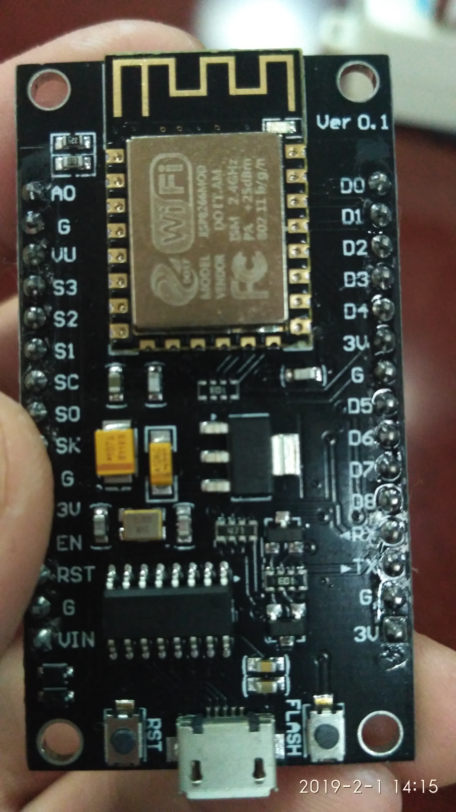
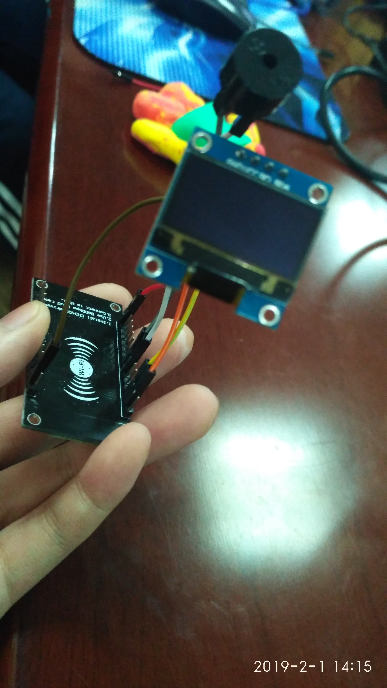
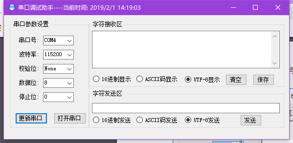
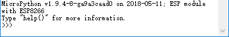
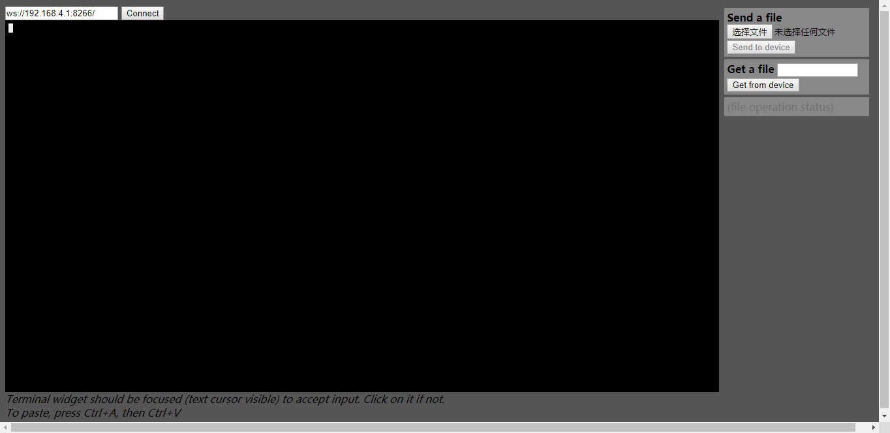
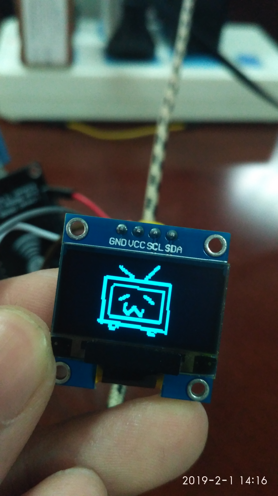

## Readme.md

### 1. 引言

这次用到的是一块**MicroPython**板(CH340G)，具体实物如图所示↓



在这块板上面有很多的针脚，用于连接各种原件，例如OLED和蜂鸣器↓



连接图如下：


### 2. 刷入固件

先从该网址下载固件：[Download Link](http://micropython.org/resources/firmware/esp8266-20180511-v1.9.4.bin)

放入文件夹，并且使用一下命令进行刷机（需要esptool，未安装请打开cmd输入pip install esptool进行安装）: 

```python
esptool.py --port COM3 --baud 460800 write_flash --flash_size=detect -fm dio 0 esp8266-20180511-v1.9.4.bin
```

然后打开[串口调试助手](Serial.exe)，进行连接（如图所示）



连接成功后会有如下的信息↓



尝试输入

```python
print ("Hello World")
```

点击发送，如果在上框中有相应的输出那么证明固件刷入成功了！

### 3. 初始化

当你安装完固件以后，你需要对其进行初始化，先打开串口调试工具，连接你的设备，输入

```python
import	webrepl_setup
```

这时候，会出现如下的信息：


这时候，请你输入E并且发送，就会出现以下信息


请你按照要求设置密码，并且牢记密码！如果系统提示说要重启系统，那么请你重启系统！

### 4. 通过WLAN热点连接

设备的连接方式用两种，其中一种就是通过设备映射出来的WIFI进行连接，如果你不知道WIFI的话那么请你在调试程序输入以下指令

```python
import	network
import	ubinascii
mac	=	ubinascii.hexlify(network.WLAN().config('mac'),':').decode()
print	(mac)
```

这会让你知道你的设备的mac地址

在你的计算机的WIFI栏里，找到你的设备WIFI（WIFI名字通常为：MicroPython-{Mac地址后六位}）


进行连接，密码通常为**micropythoN**

这种连接方式，写入文件需要通过**[Webrep](.\webrepl-master\webrepl.html)**客户端来写入

打开客户端，点connect即可（同网条件下）



连接的密码为你设置的密码，选择文件，点击send to device，文件会送达你的设备。


### 5. 运行程序

每次设备开机，都会调用main.py文件来运行，例如我的一个程序如下：

```python
from machine import Pin, PWM
import time
import ssd1306
import machine
import sys
import bilibilitv
from machine import I2C, Pin

def draw(pic,offset_x,offset_y):
    for y, row in enumerate(pic):
        for x, col in enumerate(row):
            if col == "1":
                display.pixel(x+offset_x, y+offset_y, 1)
i2c = I2C(sda=Pin(4), scl=Pin(5))
display = ssd1306.SSD1306_I2C(128, 64, i2c)
display.fill(0)

draw(bilibilitv.bilibilitv,0,0)
display.show()

tempo = 5
tones = {
 'c': 262,
 'd': 294,
 'e': 330,
 'f': 350,
 'q':369, 
 'g': 393,
 'a': 441,
 'b': 495,
 'C': 525,
 ' ': 0,
 'D':589,
 'E':661,
 'F':700,
 'G':786,
}
beeper = PWM(Pin(14, Pin.OUT), freq=440, duty=512)
melody = 'CDECaDbgebagcgedefCbCgfefqCbab CDECaDbgebagcgedefgfggegCEDEDCC'
rhythm = [32, 32, 16, 32, 16, 16, 16, 32,16,16,16,16,32,16,8,32,32,8,16,32,32,8,16,32,32,8,16,32,32,8,  32  ,32, 8, 16, 32, 16, 16, 16, 32,16,16,16,16,32,16,8,32,32,8,16,32,32,16,16,16,16,16,32,16,32,8]
for tone, length in zip(melody, rhythm):
 beeper.freq(tones[tone])
 time.sleep(tempo/length)
beeper.deinit()
```

那么这个程序会调用bilibilitv.py里面的bilibilitv变量

图案如下：



并且显示的同时还会播放[Lemon](https://music.163.com/#/song?id=536622304)（虽然只是一小段）

但是你的设备内一定要用调用的文件，也就是我这里设备内必须拥有bilibilitv.py文件！

### 6. 将图片转化为字符文档

在本仓库内，有[generate.py](generate.py)的文件，这个文件是为了将图片转化为字符文档（只会识别黑白，非黑即白），然后输出只有0和1的文档，作为OLED显示图片

具体用法：

```python
python generate.py ***                       # ***处填你的图片名字，不带后缀名，必须png格式
```

最后会转换出来***Map.py文件，在这个文件就是显示的图片的字符图（据说还可以转换Bad Apple哦！）

将这个文件导入你的设备，然后导入此文件，在显示部分替换为你的文件即可！


### 7. 通过连接同一个网络连接

这里需要用到如下的命令：

```python
import network
sta_if = network.WLAN(network.STA_IF)
sta_if.active(True)
sta_if.connect('SSID', 'Password')
sta_if.isconnected()
sta_if.ifconfig()
```

SSID请替换为你的WIFI名字，Password请替换为你的WIFI密码

（以上操作请在串口助手进行）

获得设备的IP地址后，通过cmd进行连接

在本仓库目录下打开cmd，调用webrepl_cli.py文件（同文件夹内必须拥有websocket_helper.py文件）

使用以下命令：

```
python .\webrepl_cli.py %file% -p %pw% %ip%:%file%
```

%file%是你的文件名字

%pw%是你设置的设备密码

%ip%：如果通过设备映射出来的WIFI连接，那么ip请换成你的计算机的ip地址

​	     如果是通过同一条网络进行连接，那么ip请换成你的设备ip地址


你也可以通过仓库内的sent.bat进行文件传送（Produced By bili33）具体操作方法请见sent.bat文件！

